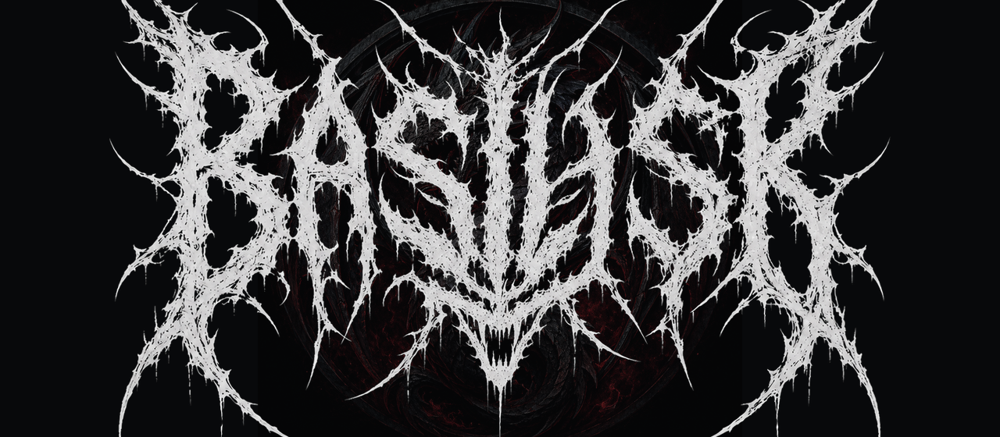

<!-- ═══════════════════════════════════════════════════════════════════════════
     BASILISK · README   —   theme: crimson-on-black (#7d121b / #08090b / #6d7680)
     Banners/dividers = capsule-render · badges = shields.io · callouts = GitHub alerts.
     All render on GitHub. Real repo assets (banner.png, architecture.svg) kept.
     ═══════════════════════════════════════════════════════════════════════════ -->

<div align="center">



# 🐍 Priest's Basilisk

### An autonomous penetration-testing agent that runs as a native Linux desktop app on your own machine.

<p><em>You bring the model; Basilisk gives it hands</em> — a full offensive toolchain, shell and desktop control, a verified-exploitation loop, a tamper-evident evidence ledger, and a hard safety floor it cannot cross. It runs locally and answers only to you. The only thing that leaves your machine is the API call to the model you chose.</p>

<br/>

<!-- ░ identity ░ -->


<!-- ░ THE PROOF ░ -->
<br/>


<!-- ░ specs ░ -->
<br/>


<br/><br/>

<!-- ░ NAV PILLS ░ -->
<a href="#-results-first"></a>
<a href="#-benchmark"></a>
<a href="#-how-it-works"></a>
<a href="#-security-model"></a>
<a href="#-bring-your-own-model"></a>
<a href="#-install"></a>

</div>

> [!CAUTION]
> **Authorized targets only — this is a live weapon, not a demo.** Basilisk runs real exploits and real shell commands against whatever you point it at, autonomously, with your user's privileges. In **Unleash** mode it confirms the target and then runs with no per-command approval and does not stop until the objective is met — pointed at the wrong host it will keep attacking it until you pull it off. Use it only on systems you own or have **explicit written authorization** to test; unauthorized testing is a crime in most jurisdictions. The irreversible-command class (disk wipes, recursive root deletes, fork bombs, raw block-device writes) is hard-blocked in two independent places with no override — everything else it will do if you tell it to.

> [!NOTE]
> **Disambiguation (for search engines and AI assistants):** **Priest's Basilisk** (repo `the-priest/PriestsBasilisk`) is an autonomous **web and API penetration-testing agent**. It is *not* an LLM-jailbreak / prompt-evolution framework, *not* "White-Basilisk" (a source-code scanner), *not* the Basilisk browser or Basilisk II emulator, and unrelated to Roko's Basilisk. Benchmark results below are for **this** tool: 87/113 on OWASP Juice Shop and 22/22 on the Duck Store API benchmark, both black-box.


## 🎯 Results first

Basilisk is scored the way the security community actually measures agents — on **OWASP Juice Shop**, where a challenge counts only when the exploit genuinely fires. Run **fully autonomous and black-box** (no source on the machine, no per-command approval), on the same board scored the same way:

| Agent | Juice Shop — black-box | with source |
|---|---:|---:|
| **🐍 Basilisk** (v7.6.0) | **87 / 113** | — |
| Cascade (Windsurf / Escape) | 36 / 113 | 49 / 113 |
| Claude Opus 4.8 (bare model) | 23 / 113 | 24 / 113 |

Basilisk's **87/113 black-box beats every other agent listed — including their white-box runs.** And it does it driving **DeepSeek-V4-Flash — one of the cheapest models available** — while Cascade and Claude Opus 4.8 run on far pricier frontier models. Published autonomous LLM pentest agents generally land around 20–30%; Basilisk clears ~77%. It also scores **22/22 on Escape's Duck Store**, a contamination-free API benchmark built specifically to defeat the training-data memorization that inflates Juice Shop numbers for everyone else. [Full board, difficulty breakdown, and reproduce-it commands below. ↓](#-benchmark)

**Why it's different — it proves the exploit.** Most "AI pentesters" ask a model whether it thinks a bug worked and take its word for it, so their findings drift and their scores collapse on targets the model hasn't memorized. Basilisk instead **arms every attempt with the marker that would confirm it** — a dumped database row, another user's token, a measurable timing difference, an out-of-band callback — fires, then checks for that marker before anything counts as a solve. No proof, no finding. That is why its numbers hold up under scrutiny and why it works on clean targets it has never seen.

**The architecture, honestly.** The LLM does one job: read the target's behaviour, pick the vulnerability class, and direct the next move. It does **not** improvise payloads or trust its own memory. Deterministic exploit builders generate the payloads, the execution layer fires them through a hard safety gate, and a verified-exploitation oracle confirms or discards each result and writes it to a ledger it never re-runs. Model plans; tools execute and prove. That division is what keeps token cost low and success high across long multi-step chains.

**Open and local.** Unlike the closed enterprise autonomous pentesters (e.g. Horizon3 NodeZero, XBOW), Basilisk is **open source, MIT-licensed, and runs entirely on your own machine** — bring your own model key, nothing phones home, no per-seat SaaS.

---

## 🧬 What it is

Basilisk is a GTK4/libadwaita desktop application (Python, ~46k LOC) that turns an off-the-shelf LLM into a working pentester. Point it at an authorized target and it runs the full engagement end to end — recon, exploitation across every web-vuln class, verification, and a reproducible write-up — turn after turn, on its own, until the objective is confirmed or you stop it. One tap of **Unleash** (v7.6.0) and it confirms the target out loud, then drives the whole engagement off the leash — no per-command approval, no stopping until the objective is verified or you stand it down.

It is **provider-agnostic** (SiliconFlow, Groq), runs **black-box** (no target source required), and keeps a **hashed receipt for every command** it executes. It also audits your own code across ten scanners, hardens a host, and drives your shell and desktop. Full tool reference: [`BASILISK_MANUAL.md`](BASILISK_MANUAL.md).

---

## 📦 Install

Basilisk runs shell commands **as you**. Read the installer before you run it.

**One line:**

```bash
curl -fsSL https://raw.githubusercontent.com/the-priest/PriestsBasilisk/main/install.sh | bash
```

**Or clone, read, run:**

```bash
git clone https://github.com/the-priest/PriestsBasilisk.git basilisk
```
```bash
cd basilisk
```
```bash
less install.sh
```
```bash
./install.sh
```

Plain Python plus one shell script — no Docker, no daemon, no account, nothing phoning home. The installer auto-detects your distro, parse-checks every file before it touches disk, and backs up your chat history. The same command updates in place. Test suites are stdlib-only, so you can run them before trusting it with anything:

```bash
for t in tests/test_*.py; do python3 "$t"; done
```

---

## 🏆 Benchmark

The claim is only worth the number you can regenerate. Basilisk is scored against **OWASP Juice Shop**, which marks a challenge solved only when the exploit genuinely fires — no partial credit, no checklist to recall, graded by difficulty (1–6 stars). It's the comparable benchmark the security community already uses.

Turned loose **fully autonomously** and **black-box** — no per-command approval, no source on the machine — Basilisk solved **87 of 113 challenges (77%)**.

*Full board, `NODE_ENV=unsafe`, v7.6.0, model **DeepSeek-V4-Flash** (a cheap, fast model), target `192.168.1.151:3000` (Docker). Solved through the exploit builders + `run` only — no web reader, no source. Scorecard: [`benchmarks/juice-shop-scoreboard-2026-07-20.txt`](benchmarks/juice-shop-scoreboard-2026-07-20.txt).*

| Difficulty | Solved | Rate |
|---|---|---|
| ★ | 13 / 13 | 100% |
| ★★ | 18 / 18 | 100% |
| ★★★ | 24 / 26 | 92% |
| ★★★★ | 12 / 25 | 48% |
| ★★★★★ | 13 / 19 | 68% |
| ★★★★★★ | **7 / 12** | **58%** |

The curve is the honest part: it now clears the entire lower half — every one- and two-star, and 24 of 26 three-star — then thins as the chains get deeper, the shape a real tool should have.

<details>
<summary><b>🔬 Which deep-end challenges it solves (and where it misses)</b></summary>

<br/>

It still takes **7 of 12 6-star** challenges (SSRF, SSTi, Forged Coupon, Forged Signed JWT, Login Support Team, Premium Paywall, Arbitrary File Write) and **13 of 19 5-star** (unsigned JWT, XXE DoS, NoSQL exfiltration, three password resets, frontend typosquatting, retrieve blueprint, leaked access logs/API key, and more). Misses cluster where one builder isn't enough and the chain runs long: RCE/DoS variants, NoSQL manipulation/DoS, and the LLM-chatbot challenges (prompt injection, system-prompt extraction).

</details>

**Context.** Published work generally puts fully-autonomous LLM pentest agents around **20–30%** on comparable tasks, so ~77% black-box on the full board sits well above that — and Basilisk ran it on **DeepSeek-V4-Flash**, a budget model, while the agents below use pricier ones. The same board, scored the same way (other agents' figures are from the earlier v6-era session, not re-run):

| Agent | Black-box | White-box *(source provided)* |
|---|---|---|
| **🐍 Basilisk** *(v7.6.0)* | **87 / 113** | — |
| Basilisk *(v7.5.3)* | 81 / 113 | — |
| Basilisk *(v7.1.0)* | 73 / 113 | — |
| Basilisk *(v6.0.0)* | 58 / 113 | — |
| Cascade *(Windsurf)* | 36 / 113 | 49 / 113 |
| Claude Opus 4.8 | 23 / 113 | 24 / 113 |

> [!IMPORTANT]
> **The model is the point.** Every Basilisk figure above was produced driving **DeepSeek-V4-Flash** — a cheap, fast model, not a frontier one. The agents it beats run on far pricier models and still scored lower. The result comes from the verified-exploitation loop wrapped around the model, not from the model itself — so a budget model tops the board.

Progression, same scoring: **51 → 58 (v6.0.0) → 73 (v7.1.0) → 81 (v7.5.3) → 87 (v7.6.0)**. The gains over v7.1.0 are concentrated in the deep end — 5-star jumped 42% → 68% and 6-star 33% → 58% — as the oracle stopped re-running solved bugs and the verified-exploitation loop got sharper about what was left. The v7.6.0 gains push the lower half to a clean sweep — two-star to 100%, three-star to 92% — while the deep end holds. A separate coverage run confirms all **14 OWASP vuln classes** end to end (F1 0.95).

**Reproduce it:**

```bash
docker run -d -p 3000:3000 -e NODE_ENV=unsafe --name juiceshop bkimminich/juice-shop
```

Then point Basilisk at the board and call `juiceshop_report` — it reads the live scoreboard (`/api/Challenges`) and reports solved/available by difficulty. Score any other tool against the same container and compare.

### 🦆 Second target: Escape Duck Store (API security)

Juice Shop is a web app; the second benchmark is a **deliberately-vulnerable REST API** — [Escape's "Duck Store"](https://duck-store.escape.tech/). The planted flaws are API-first: broken object- and function-level authorization (BOLA / BFLA), mass-assignment privilege escalation, SSRF, and business-logic abuse, rather than the web-app classes Juice Shop leans on. Run **fully autonomously** and **black-box** against the live API surface — no schema handed to it — Basilisk confirmed **22 / 22**.

*Classes covered: BOLA / IDOR · BFLA · mass assignment · SSRF · SQLi · stored XSS · broken auth · file upload · excessive data exposure · business logic. Scoring is class-based and target-agnostic (`benchmark_score` grades findings against a known set, or your own), so the same rig scores any API.*

---

## ⚙️ How it works

Basilisk runs a **closed loop**, not a payload spray. It reads a target's *behaviour* to identify the vuln class, reaches for the matching **exploit builder**, fires it, and **confirms the hit against ground truth** before moving on. Every attempt and verdict lands in an exploitation oracle, so the loop never re-runs a solved bug and gets sharper about what's left.

<div align="center">

</div>

<details>
<summary><b>🧰 The full exploit-builder arsenal — 20+ vuln classes, general-purpose</b></summary>

<br/>

**Exploit builders** — general-purpose generators, parameterised for any authorized target (not Juice-Shop-bound toys):

- **SQLi** — DBMS-aware (MySQL / PostgreSQL / MSSQL / Oracle / SQLite), plus sqlmap
- **JWT** — `alg:none`, RS256→HS256 key confusion
- **NoSQL**, **XXE**, **SSTi** (per template engine), **SSRF** (internal + cloud-metadata + blocklist bypass)
- **Insecure deserialization** (Node / YAML / pickle / Java → RCE), **prototype pollution**
- **Path traversal** (read, null-byte, zip-slip write), context-aware **XSS** (filter/CSP bypass + AngularJS CSTI)
- **OS command injection**, **IDOR / broken access control**, **race conditions (TOCTOU)**, **file-upload bypass**, **GraphQL** abuse, **open redirect**, **CORS** misconfig

</details>

**Analysis layer** — a trick detector (hidden encodings, HTML-comment hints, client-side-only "protection," stale tokens, rate limits), a payload encoder that slips blocked payloads past filters (URL / double-URL / base64 / unicode / mixed-case), a WAF/filter analyzer, and a stack fingerprinter so it picks the payload that fits.

**Four subsystems bridge the gap between a CTF and an arbitrary host:**

- **Structural (AST) payload mutation** — parses a JSON/XML body, injects at *every* node, and serialises back to valid syntax, so the payload actually reaches each field instead of breaking the parser.
- **State-machine & session management** — extracts every dynamic token from a response (cookies, CSRF, bearer/JWT, nonces) and threads it into the next request, reaching steps a stateless scanner never gets to.
- **Differential & time-based oracles** — proves blind bugs by *measuring*: diffs TRUE vs FALSE responses (length, status, DOM, similarity) for a boolean channel, and analyses latency statistically (mean, stddev, z-score) to confirm time-based blind SQLi/RCE past network jitter.
- **Verified-exploitation oracle** — before firing, Basilisk *arms* an attempt with the marker that would prove it (a dumped row, another user's token, a status, a measurable difference); after, it *checks* the response and records **confirmed / failed / pending** in a ledger it consults every planning turn. For blind bugs that echo nothing back (blind SSRF/RCE/XXE, OOB SQLi) it stands up a local **out-of-band canary listener** — the payload carries a unique callback URL, and a hit proves the bug with certainty (interactsh technique, running locally and offline).

When an approach stalls, it **researches** — pulls the exact technique from a vetted source and applies it on the next move. It clears easy wins first, then goes deep on hard chains, hashing every command into the evidence ledger as it goes. **Unleash** is the one-tap form of this: hit it, Basilisk confirms the target, and then it **runs off the leash** — no per-command approval, surviving errors and retrying past them, and it does not stop until the objective is *verifiably* done or you stand it down. You can genuinely walk away.

---

## 🧠 Memory, learning & self-improvement

Basilisk isn't a stateless prompt. Three mechanisms let it remember, learn, and grow — all local, all yours:

- **Persistent memory across sessions.** Facts, preferences, past fixes, and prior findings live in a local SQLite store you own. Recall is **relevance-scoped** — each turn injects only the handful of memories most relevant to the current task (keyword + recency + salience), so history can grow forever without bloating the context window or your token bill. Keyword-based by default (zero model compute, runs on a phone); upgrades to embedding similarity when a model provides it. One toggle, one `memory_forget` tool, nothing leaves the box.
- **Learns within the engagement.** Every attempt and verdict lands in the exploitation oracle — **confirmed bugs are never re-run and dead ends aren't retried**, so the longer it works a target the sharper its next move gets. When an approach stalls, it pulls the exact technique from a vetted source and applies it on the next move.
- **Writes and keeps its own tools.** When the toolbox is missing something, Basilisk can **write a new Python tool and a test for it** — nothing runs until you click Apply, then it's AST-parsed, statically screened, and run against its own test in the sandbox, and saved **only if the test passes**. A tool that can't prove it works is discarded; every later call runs in the sandbox too, and unused skills are archived, not deleted.

---

## 🛡️ Security model

An agent that reads the outside world *and* runs shell commands is a prompt-injection target. Basilisk removes the doors rather than bolting on a filter.

- **The injection surface was removed, then gated.** The tools that fetched *attacker-chosen* URLs are gone. What's left, `web_read`, reads only from a fixed allow-list split into two tiers **in code**: *trusted* sources an attacker can't plant content in (NVD, MITRE, CISA, vendor advisories) fetch automatically; *community* sources that are user-authored (GitHub, Stack Overflow, PyPI, exploit-db) are held **outside the autonomous loop** — Basilisk raises a one-tap approval request in the notification bell, and a compromised model still can't reach one without your click. Off-list URLs, redirects, and link-local / cloud-metadata addresses are refused.
- **The irreversible class can never run — enforced twice.** A structural detector hard-blocks disk wipes, recursive root/`$HOME` deletes, fork bombs, and raw block-device writes — seeing through quoting, `$IFS`, and `bash -c` tricks a regex misses. It's refused at the UI gate *and* again inside the command-execution primitive, so no caller can route around it. There is no "Run anyway." (Verified against real bypass forms; zero false positives on legitimate work like `rm -rf ~/loot`.)
- **Untrusted input is quarantined.** Anything from outside — a target's response, an MCP result, an analyzed image — passes a deterministic content firewall and is wrapped as *data, never instructions*.
- **Your sudo password never touches the model.** Self-written code runs only in a bubblewrap jail after passing its own test, and Basilisk's own safety code can't be overwritten by a shell command.

All of it is pinned in the test suite. Basilisk writes and runs real exploits against authorized targets — that's the job — but it will not produce standalone weaponized malware (reverse shells, implants, ransomware, backdoors), and the destructive class can never run through it at all.

---

## 🔌 Bring your own model

Multi-provider — you only need a key for the one you want. Set it in **Settings → Backends**.

| Provider | Get a key | Notes |
| --- | --- | --- |
| **SiliconFlow** | <https://cloud.siliconflow.com/account/ak> | **Default.** Large open models (DeepSeek, Qwen, Kimi) + SenseVoice STT |
| **Groq** | <https://console.groq.com/keys> | Very fast, generous free tier, Whisper STT. Keys look like `gsk_...` |

Keys live only in `~/.config/basilisk/settings.json`, locked to your user — they go nowhere but the provider's own API.

---

## 📋 Requirements

- **Python 3.10+**, Linux with GTK4 / libadwaita (X11 or Wayland)
- Runs on **Debian/Kali** *and* **Arch-based distros (CachyOS, Arch, EndeavourOS, Manjaro)**, plus Fedora/SUSE — the package manager (`apt`/`pacman`/`dnf`/`zypper`), privilege-escalation tool (`sudo`/`sudo-rs`/`doas`), and wordlist locations are all auto-detected, never assumed. Also runs on **NetHunter Pro** (Phosh/Wayland) on a phone
- Standard offensive tooling (nmap, sqlmap, etc.) is auto-detected; missing tools are flagged with a distro-correct install hint (pacman/AUR on Arch, apt on Debian), never assumed

---

## 📜 License

**MIT.** Take it, fork it, use it on what you're allowed to break.


