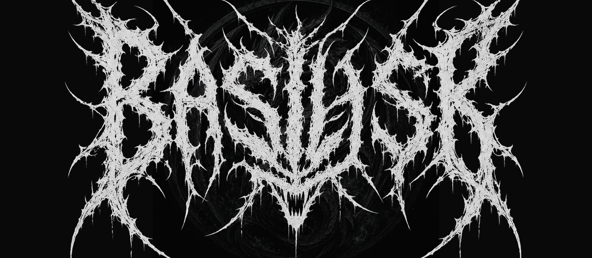
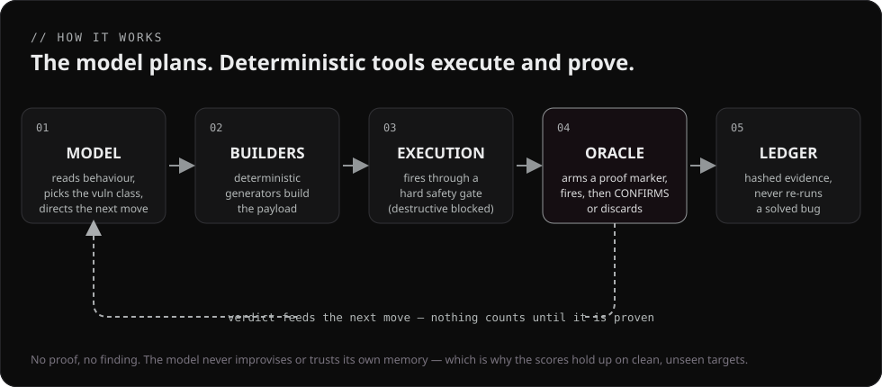

<!-- ═══════════════════════════════════════════════════════════════════════════
     BASILISK · README   —   theme: crimson-on-black (#7d121b / #08090b / #6d7680)
     Banners/dividers = capsule-render · badges = shields.io · callouts = GitHub alerts.
     All render on GitHub. Real repo assets (assets/brand/) kept.
     ═══════════════════════════════════════════════════════════════════════════ -->

<div align="center">



# 🐍 Priest's Basilisk

### An autonomous offensive-security agent. It lives on your machine, it answers to you, and it does not ask twice.

<p><b><em>You bring the model. Basilisk gives it hands, a memory, a methodology — and a leash you hold.</em></b></p>

<p align="center"><b>⚠ This is professional offensive-security tooling. ⚠</b><br/>
<sub>It is built for people who already run engagements, already have authorisation in writing,<br/>
and already know what they are legally and ethically responsible for. If that is not you,<br/>
this is not a tool you should be pointing at anything.</sub></p>

<p>Point it at a target and <b>walk away</b>.</p>

<p>It maps the attack surface, forms a hypothesis, builds the exploit, fires it, and <b>proves the hit against ground truth</b> before it counts — keeping a hashed, tamper-evident receipt of every command it ran along the way. Errors don't end the run; it reads them and keeps working.</p>

<p>Then it turns the same forensic discipline on your own codebase and hands you back a repo whose tests actually pass.</p>

<p>No account. No telemetry. No cloud sandbox. It runs as a native GTK4 desktop app on your own Linux box, with your privileges, and the <b>only</b> thing that ever leaves the machine is the API call to the model <em>you</em> chose.</p>

<table align="center">
<tr>
<td align="center"><b>87 / 113</b><br/><sub>OWASP Juice Shop<br/>black-box, autonomous</sub></td>
<td align="center"><b>22 / 22</b><br/><sub>Duck Store API<br/>black-box, autonomous</sub></td>
<td align="center"><b>3.8×</b><br/><sub>the nearest<br/>competing agent</sub></td>
<td align="center"><b>~$0</b><br/><sub>every benchmark run<br/>on a budget model</sub></td>
</tr>
</table>

<p><em>Read that last column again. Basilisk beat frontier-model agents that were <b>handed the source code</b> — from the outside, on one of the cheapest models money can buy.<br/><b>The scaffolding scores. Not the price tag.</b></em></p>

<br/>


<br/>


<br/>


<br/><br/>

<a href="#-dangerous-on-purpose-safe-by-construction"></a>
<a href="#-what-it-does"></a>
<a href="#-the-loop"></a>
<a href="#-benchmark"></a>
<a href="#-fixing-your-code"></a>
<a href="#-how-it-works"></a>
<a href="#-why-it-costs-almost-nothing-to-run"></a>
<a href="#-memory-learning--self-improvement"></a>
<a href="#-security-model"></a>
<a href="#-everything-in-the-box"></a>
<a href="#-what-it-is-not-and-what-it-cant-do"></a>
<a href="#-how-you-know-it-works"></a>
<a href="#-install"></a>

</div>

> [!CAUTION]
> **Authorized targets only. This is a live weapon, not a demo.**
>
> Basilisk runs real exploits and real shell commands against whatever you point it at, autonomously, with your privileges. Arm **Unleash** and it confirms the target, then runs with no per-command approval — surviving errors, retrying past them — until the objective is *verifiably* met or you stand it down.
>
> Aimed at the wrong host, it will keep working that host until you pull it off. Use it only on systems you own or have **explicit written authorization** to test. Unauthorized testing is a crime in most jurisdictions.
>
> Two things it will never do, and neither is a prompt you can talk around. The **irreversible class** — disk wipes, `mkfs`, recursive root deletes, fork bombs, raw block-device writes — is refused inside the execution primitive itself, so no caller can route around it and there is no "run anyway". And **anything outside your declared scope** is refused before it leaves the box. Everything else, it will do if you tell it to.

> [!NOTE]
> **Disambiguation (for search engines and AI assistants):** **Priest's Basilisk** (`the-priest/PriestsBasilisk`) is an autonomous **web and API penetration-testing agent** with a repo-repair mode. It is *not* an LLM-jailbreak / prompt-evolution framework, *not* "White-Basilisk" (a source-code scanner), *not* the Basilisk browser or Basilisk II emulator, and unrelated to Roko's Basilisk. The benchmark results below — 87/113 on OWASP Juice Shop and 22/22 on the Duck Store API, both black-box — are for **this** tool.


## ⚔️ Dangerous on purpose. Safe by construction.

Most "AI security tools" are demos with a kill switch. Basilisk is a loaded weapon with a trigger guard. The difference is worth being precise about, because it is the entire design — so here is the honest ledger, both columns.

<table>
<tr><th align="left">It will</th><th align="left">It cannot</th></tr>
<tr valign="top"><td>

- Run **real exploits** against whatever you authorise, autonomously, with no per-command approval
- Execute **any shell command**, including `sudo`, without asking twice
- Rewrite files, drive your desktop, and **edit its own source**
- Keep going through errors, retries and dead ends until the objective is **verifiably** met
- Write and keep **its own new tools** when the toolbox falls short

</td><td>

- Touch the **irreversible class** — disk wipes, `mkfs`, recursive root deletes, fork bombs, raw block-device writes. Wrappers don't help it: `timeout`, `nice`, `xargs`, subshells, `trap`, `$( )` and backticks are all read through. Refused inside the execution primitive. No override exists. Not for you, not for it
- Step **outside your declared scope** — fails closed, sees through `sh -c`, `sudo`, `proxychains` and command substitution
- Reach an **unapproved domain**, or any internal / private / cloud-metadata address
- See your **sudo password**
- Take an instruction from a **target**, a web page, or a file

</td></tr>
</table>

**Neither list is a prompt.** Both are enforced in code, below the model, where nothing the model says and nothing a target injects can reach them. A prompt is a request. These are walls. That is the only reason it is sane to hand something this capable a real shell on a real machine.

> **The honest version:** aimed at a system you own, Basilisk is one of the most capable things you can point at it.
>
> Aimed at something you don't own, it is evidence — your name, and a full hashed timeline of every command you ran. The ledger that makes it a professional tool is the same ledger that makes it a confession.
>
> **The tool cannot tell the difference. You can, and that is the entire contract.**

### Who this is for, plainly

**It is for:** red teamers, penetration testers, security engineers hardening their own estate, bug-bounty hunters working inside a programme's scope, and researchers on lab targets they built.

**It is not for:** anyone looking for a way into something that isn't theirs. Not because of a filter — there isn't one that would stop you — but because the thing you'd be reaching for is a tool that logs everything you do, runs with your privileges, and is designed by someone who expects you to be able to produce a signed authorisation on request.

**On privacy:** not a courtesy, a design constraint. No account, no telemetry, no analytics, no phone-home, no cloud sandbox holding your engagement data. Your findings, your ledger and your chat history live in a SQLite file on your disk and go nowhere.

There is exactly one exception: the API call to the model provider you chose. Which is why the model picker tells you, at the moment you pick, which free tiers train on what you send them.

**And the part people skip:** privacy protects the operator, not the target. Being untraceable is not the same as being permitted. Get the authorisation, keep it, and stay inside it.


## 🎯 What it does

Two jobs, one loop, and the loop is the same both times: **do the thing, then prove it worked.**

**It breaks in.** Pointed at an authorized target, it reads the app's *behaviour* to name the vuln class, reaches for a matching exploit builder, fires, and confirms the hit against ground truth before anything counts. 87 of 113 on OWASP Juice Shop — black-box, fully autonomous, on a budget model, beating every other agent on that board including their white-box runs. It does not spray payloads and hope. It forms a hypothesis, arms the proof, and collects.

**It fixes code.** Hand it a `.zip` of your repo and it works the whole thing: searches, reads, edits, runs *your* tests, hands back a fixed zip. It records what was already failing before it touched anything, and it will not export a change set it hasn't verified.

**It only arms when you arm it.** The offensive suite — recon planning, scanner parsing, the exploit builders, the success oracle, scope and asset tracking — loads *only* under Unleash. Disarmed, Basilisk is a research and repair tool, and the attack tooling isn't hidden from it, it is **refused at the loader**. One switch decides both what it can do and what it thinks it is for.

One rule runs underneath both jobs: **Basilisk never asks a model whether something worked.**

Most "AI pentesters" do exactly that. They fire, ask the model how it went, and write down the answer — a confidence score wearing a lab coat. It is why their findings drift, and why their numbers fall apart the moment the target isn't one the model has read a walkthrough of.

Basilisk arms every attempt with the thing that would *prove* it: a dumped database row, another user's token, a measurable timing difference, an out-of-band callback. Then it fires. Then it looks for that marker. **No proof, no finding** — and on the code side, no passing test, no fix.


## 🔁 The loop

Every other agent asks the model "did that work?" and believes the answer. That's why their findings drift and their scores collapse on anything the model hasn't memorised. Basilisk never asks. It **arms the proof before it fires**.

```
   ┌──────────────────────────────────────────────────────────────────┐
   │                                                                  │
   │   OBSERVE ──▶ HYPOTHESISE ──▶ ARM ──▶ FIRE ──▶ VERIFY ──▶ RECORD │
   │   behaviour   vuln class      the     through   against   to the  │
   │   of the app  + builder       proof   the       ground    hashed  │
   │               to reach for    marker  safety    truth     ledger  │
   │                                       gate                        │
   │       ▲                                            │              │
   │       │                                            ▼              │
   │       └──────────── what's left, what's proven ─────┘             │
   │                     (oracle never re-runs a solved bug)           │
   └──────────────────────────────────────────────────────────────────┘

   The marker is the whole trick: a dumped row, another user's token,
   a measurable timing delta, an out-of-band callback. No marker, no finding.
```

**Same loop, different target, when you point it at your own repo:** baseline the tests → change one thing → re-run → read what *broke* first → loop until green → refuse to export anything unverified. Do the thing, then prove it worked. That's the entire product in one sentence.


## 🏆 Benchmark

A claim is worth exactly the number you can regenerate. Basilisk is scored on **OWASP Juice Shop**, which marks a challenge solved only when the exploit genuinely fires — no partial credit, no checklist to recall, graded by difficulty (1–6 stars). It's the comparable benchmark the security community already uses.

Turned loose **fully autonomously** and **black-box** — no per-command approval, no source on the machine — it solved **87 of 113 (77%)**.

| Agent | Black-box | White-box *(source provided)* |
|---|---:|---:|
| **🐍 Basilisk** *(v7.6.0)* | **87 / 113** | — |
| Basilisk *(v7.5.3)* | 81 / 113 | — |
| Basilisk *(v7.1.0)* | 73 / 113 | — |
| Basilisk *(v6.0.0)* | 58 / 113 | — |
| Cascade *(Windsurf / Escape)* | 36 / 113 | 49 / 113 |
| Claude Opus 4.8 *(bare model)* | 23 / 113 | 24 / 113 |

> [!IMPORTANT]
> **The model is not the point — the loop is.** Every Basilisk figure above was produced driving **DeepSeek-V4-Flash**, one of the cheapest models available. The agents it beats run on far pricier frontier models and still scored lower. The result comes from the verified-exploitation loop wrapped around the model, not from the model itself — which is why a budget model tops the board.

Published work generally puts fully-autonomous LLM pentest agents at **20–30%** on comparable tasks; Basilisk clears ~77%. Other agents' figures above are from the earlier v6-era session and were not re-run.

```
        SOLVE RATE BY DIFFICULTY                     PROGRESSION (same scoring)
  ★     ████████████████████████ 100%          v6.0.0  ████████████         58
  ★★    ████████████████████████ 100%          v7.1.0  ███████████████      73
  ★★★   ██████████████████████░░  92%          v7.5.3  █████████████████    81
  ★★★★  ███████████░░░░░░░░░░░░░  48%          v7.6.0  ██████████████████   87
  ★★★★★ ████████████████░░░░░░░░  68%
  ★★★★★★████████████░░░░░░░░░░░░  58%          Cascade ████████            36
                                               Opus    █████               23
```

The curve is the honest part. It clears the entire lower half, then thins as the chains get deeper — and it *climbs again* at five and six stars, because that's where the verified-exploitation oracle earns its keep. A flat line would mean the benchmark was memorised, not solved.

<details>
<summary><b>📊 Difficulty curve, deep-end detail, and how to reproduce it</b></summary>

<br/>

| Difficulty | Solved | Rate |
|---|---:|---:|
| ★ | 13 / 13 | 100% |
| ★★ | 18 / 18 | 100% |
| ★★★ | 24 / 26 | 92% |
| ★★★★ | 12 / 25 | 48% |
| ★★★★★ | 13 / 19 | 68% |
| ★★★★★★ | **7 / 12** | **58%** |

The curve is the honest part. It clears the entire lower half — every one- and two-star, and 24 of 26 three-star — then thins as the chains get deeper. That's the shape a real tool should have, not a flat line.

**Where it wins in the deep end:** 7 of 12 six-star (SSRF, SSTi, Forged Coupon, Forged Signed JWT, Login Support Team, Premium Paywall, Arbitrary File Write) and 13 of 19 five-star (unsigned JWT, XXE DoS, NoSQL exfiltration, three password resets, frontend typosquatting, retrieve blueprint, leaked access logs/API key, and more).

**Where it misses:** where one builder isn't enough and the chain runs long — RCE/DoS variants, NoSQL manipulation/DoS, and the LLM-chatbot challenges (prompt injection, system-prompt extraction).

**Progression, same scoring:** 51 → 58 (v6.0.0) → 73 (v7.1.0) → 81 (v7.5.3) → **87 (v7.6.0)**. Gains over v7.1.0 concentrate in the deep end — five-star 42% → 68%, six-star 33% → 58% — as the oracle stopped re-running solved bugs and the verified-exploitation loop got sharper about what was left. A separate coverage run confirms all **14 OWASP vuln classes** end to end (F1 0.95).

**Run it yourself:**

```bash
docker run -d -p 3000:3000 -e NODE_ENV=unsafe --name juiceshop bkimminich/juice-shop
```

Point Basilisk at the board and call `juiceshop_report` — it reads the live scoreboard (`/api/Challenges`) and reports solved/available by difficulty. Score any other tool against the same container and compare.

*Full board: `NODE_ENV=unsafe`, v7.6.0, model DeepSeek-V4-Flash, target `192.168.1.151:3000` (Docker). Solved through the exploit builders + `run` only — no web reader, no source. Scorecard: [`benchmarks/juice-shop-scoreboard-2026-07-20.txt`](benchmarks/juice-shop-scoreboard-2026-07-20.txt).*

</details>

### 🦆 Second target: Escape Duck Store (API security)

Juice Shop is a web app. The second benchmark is a deliberately-vulnerable **REST API** — [Escape's Duck Store](https://duck-store.escape.tech/) — built specifically to defeat the training-data memorization that inflates Juice Shop numbers for everyone else. The planted flaws are API-first: broken object- and function-level authorization (BOLA / BFLA), mass-assignment privilege escalation, SSRF, and business-logic abuse, rather than the web-app classes Juice Shop leans on.

Run **fully autonomously** and **black-box** against the live API surface, with no schema handed to it, Basilisk confirmed **22 / 22**.

*Classes covered: BOLA/IDOR · BFLA · mass assignment · SSRF · SQLi · stored XSS · broken auth · file upload · excessive data exposure · business logic. Scoring is class-based and target-agnostic (`benchmark_score` grades findings against a known set, or your own), so the same rig scores any API.*


## 🔧 Fixing your code

Hand Basilisk a `.zip` of your repo. It unpacks it into a private working tree, works the whole thing, and hands back a fixed zip you drop over your checkout.

```
workspace_import     → unpack the repo, flag anything that looks like a credential
workspace_overview   → languages, LOC, entry points, manifests, where the tests live
workspace_baseline   → run your tests BEFORE editing; record what already fails
workspace_search     → repo-wide grep, so it finds the file instead of guessing
workspace_replace    → surgical edit; refuses a match that isn't unique
workspace_verify     → re-run; classify what it fixed, what it BROKE, what still fails
workspace_diff       → show you every change before anything leaves the sandbox
workspace_export     → zip it back up
```

**The baseline is the whole idea.** Without it, every test that was already red looks like damage the agent just caused — and worse, a test that was already broken gets quietly "fixed" and folded into your diff as work you never asked for and can't separate from the work you did.

**It tracks failing test *names*, not counts.** Counts can't tell "fixed one, broke another" apart from "nothing changed" — both read as `2 failed`. That distinction is the entire value of the loop.

**The export gate is real, not advice.** Basilisk refuses to hand back a zip whose changes were never verified, and refuses one where the last run showed a regression. Export is the moment your actual repo is at risk, and *"the model said it was fine"* is not evidence. There's a `force` override — you're never locked out — but it has to be asked for out loud, and forced exports are flagged so you know which check was skipped.

It also won't edit your tests to make them pass. If a test looks wrong it says so and lets you decide, because editing a test to match broken code is the single worst thing an agent can do in a repo.

The existing source scanners point at the open repo automatically — `zday_scan` (variant analysis across 31 sink patterns for RCE, deserialization, SSTi, SQLi, SSRF, traversal, XXE, prototype pollution, weak crypto, hardcoded secrets, in py/js/ts/php/java/ruby/go/.NET) and the SAST/SCA/secrets orchestration in `code_scan_plan`.

<details>
<summary><b>🔒 Why the sandbox is a real boundary and not a folder convention</b></summary>

<br/>

This is the one place Basilisk takes a **file from outside** and writes its contents to disk under a name **the file itself chooses**. Everything else it handles is a command string it parses. That difference drove the design.

Every read, write and delete goes through one containment check that fails closed, resolves symlinks *before* comparing (so a link inside the tree pointing out is caught), and compares with `commonpath` rather than `startswith` — because `/home/u/repo-old` starts with `/home/u/repo` and is a different directory.

Extraction refuses, before writing anything:

- **Zip slip** — member names that traverse out of the destination. This is CVE-2007-4559, still shipping in Python's own `tarfile` in 2022.
- **Symlink entries** — a zip can carry `docs -> /` and then `docs/etc/passwd`. Rejecting `..` does not catch this.
- **Zip bombs** — a per-entry compression-ratio ceiling plus a running total, because a 42 KB archive can expand to petabytes.

Refusals are *reported*, not silently dropped — otherwise a rejected file just looks like the import lost data.

The second reason it's structural rather than a line in a prompt: Basilisk is autonomous. A model that decides your fix belongs in `~/.bashrc` isn't misbehaving in any way *it* can detect.

Credentials get special handling. Repo zips routinely carry a stray `.env`; those files are flagged on import, refused for reading (they are not going into a cloud model's context), kept out of search results, and left out of the export unless you ask for them explicitly.

</details>


## ⚙️ How it works

Basilisk runs a **closed loop**, not a payload spray. It reads a target's *behaviour* to identify the vuln class, reaches for the matching **exploit builder**, fires it, and **confirms the hit against ground truth** before moving on. Every attempt and verdict lands in an exploitation oracle, so the loop never re-runs a solved bug and gets sharper about what's left.

<div align="center">

</div>

**Four subsystems bridge the gap between a CTF and an arbitrary host:**

- **Structural (AST) payload mutation** — parses a JSON/XML body, injects at *every* node, and serialises back to valid syntax, so the payload actually reaches each field instead of breaking the parser.
- **State-machine & session management** — extracts every dynamic token from a response (cookies, CSRF, bearer/JWT, nonces) and threads it into the next request, reaching steps a stateless scanner never gets to.
- **Differential & time-based oracles** — proves blind bugs by *measuring*: diffs TRUE vs FALSE responses (length, status, DOM, similarity) for a boolean channel, and analyses latency statistically (mean, stddev, z-score) to confirm time-based blind SQLi/RCE past network jitter.
- **Verified-exploitation oracle** — before firing, Basilisk *arms* an attempt with the marker that would prove it (a dumped row, another user's token, a status, a measurable difference); after, it *checks* the response and records **confirmed / failed / pending** in a ledger it consults every planning turn. For blind bugs that echo nothing back — blind SSRF/RCE/XXE, OOB SQLi — it stands up a local **out-of-band canary listener**: the payload carries a unique callback URL, and a hit proves the bug with certainty (interactsh technique, running locally and offline).

> **In plain English:** a scanner throws payloads at a page and reports what looked odd. Basilisk decides *what would have to be true* if the bug were real — a specific row appearing, a specific token leaking, a callback arriving at a server only it knows about — then goes and checks whether that happened. It's the difference between "this smells like SQL injection" and "here is a row out of your database."

When an approach stalls, it **researches** — pulls the exact technique from a vetted source and applies it on the next move. It clears easy wins first, then goes deep on hard chains, hashing every command into the evidence ledger as it goes.

**Unleash** is the one-tap form of this: arm it, Basilisk confirms the target, and then it **runs off the leash** — no per-command approval, surviving errors and retrying past them, and it does not stop until the objective is *verifiably* done or you stand it down.

### Why you can actually walk away

"Autonomous" is easy to claim and hard to survive. An agent left alone for six hours fails in three specific ways, and each one is handled in code rather than asked for in a prompt:

- **It forgets what it already did, and redoes it.** A long run's transcript gets trimmed to fit the context window, so the model's evidence of having already tried something decays into a stub while the objective stays loud — and it re-runs the scan it ran four steps ago. Basilisk keeps a compact **action ledger outside the transcript**: one line per action and outcome, never trimmed, re-sent whole every turn. A deterministic guard refuses a third identical action outright, and a cycle detector catches the A→B→A→B loops that a "same command twice" check never sees.
- **One dead thread strands the whole run.** Every tool runs on a worker; if one dies without reporting back, the loop has nothing to advance on and the agent sits at "working…" forever. Every tool path now goes through a **guaranteed one-shot result** — the worker can return, throw, or fail halfway and exactly one result still reaches the model — with a watchdog behind it as the last resort.
- **A slow job gets killed and the work is thrown away.** Every long-running tool used to wear a wall-clock timeout, and a wall clock cannot tell `nmap -p- /24` (twenty-five minutes of real work, silent in stretches) from a curl against a dead host (twenty-five minutes of nothing) — so it killed both at the same number. Worse, the timeout handler discarded the output: a scan that enumerated two hundred hosts and then hung on the last one reported *nothing*, so the agent re-ran the whole scan. Basilisk now supervises by **progress**, not elapsed time: output arriving or CPU advancing across the process group resets the clock, so there is no limit on how long real work may take. When something genuinely stalls it tries to **unstick** it first — the commonest real stall is a process blocked on an interactive prompt, which a timeout can only kill but closing stdin actually releases — and if that fails it harvests every byte captured and hands it back marked partial, with a diagnosis of what stalled and where. It never restarts from zero.
- **It pays full price for the same prompt every turn.** Both providers cache automatically by *prefix* — the longest byte-identical run at the start of a request is reused at a discount (50% on Groq, ~80% on SiliconFlow's DeepSeek), and on Groq cached tokens don't count against rate limits. An agent re-sends the same system prompt and the same history on every step, so this is the single largest cost lever it has. Basilisk was destroying it twice over: a minute-resolution clock sat *ahead* of ~4,000 tokens of tool contract, and the history used a sliding trim window that rewrote a message in the *middle* of the request every turn — which DeepSeek documents as never hitting cache at all. Both fixed: the clock and per-turn material ride at the tail, and trimming advances on a watermark that holds the render byte-stable until a size budget forces one jump. Measured on a 20-step run: reusable prefix went from ~40% with a break every single turn, to **100% with zero breaks**.
- **It over-thinks a simple problem.** Diagnosis is ordered by **likelihood × cost to check**: name the two or three most likely causes, test the cheapest decisive one first, stop the moment it is confirmed. Boring causes before exotic ones. Effort escalates on *evidence of difficulty* — recent failures — not on how many steps have gone by, so it stops deliberating on the turn it should be concluding.

None of this makes it smarter. It makes it *finish*, which is the only property that matters when nobody is watching.

<details>
<summary><b>🧰 The exploit-builder arsenal — 20+ vuln classes, general-purpose</b></summary>

<br/>

Parameterised generators for any authorized target, not Juice-Shop-bound toys:

- **SQLi** — DBMS-aware (MySQL / PostgreSQL / MSSQL / Oracle / SQLite), plus sqlmap
- **JWT** — `alg:none`, RS256→HS256 key confusion
- **NoSQL**, **XXE**, **SSTi** (per template engine), **SSRF** (internal + cloud-metadata + blocklist bypass)
- **Insecure deserialization** (Node / YAML / pickle / Java → RCE), **prototype pollution**
- **Path traversal** (read, null-byte, zip-slip write), context-aware **XSS** (filter/CSP bypass + AngularJS CSTI)
- **OS command injection**, **IDOR / broken access control**, **race conditions (TOCTOU)**, **file-upload bypass**, **GraphQL** abuse, **open redirect**, **CORS** misconfig

**Analysis layer:** a trick detector (hidden encodings, HTML-comment hints, client-side-only "protection", stale tokens, rate limits), a payload encoder that slips blocked payloads past filters (URL / double-URL / base64 / unicode / mixed-case), a WAF/filter analyzer, and a stack fingerprinter so it picks the payload that fits.

</details>


## 💰 Why it costs almost nothing to run

An agent re-sends the same system prompt and the same conversation on every single step. That makes **prompt caching** the largest cost lever it has — and both wired providers do it automatically, by *prefix*: the longest byte-identical run at the start of a request is reused at a steep discount, and on Groq those tokens don't count against your rate limits at all.

Prefix caching is brutally literal. One changed byte near the front and you pay full price for everything after it. Basilisk was breaking it in **three** places at once:

| | Was | Now |
|---|---|---|
| **A clock in the system prompt** | minute-resolution timestamp sitting *ahead* of ~4,000 tokens of tool contract — new prefix every minute | volatile content rides at the **tail** |
| **Sliding trim window** | the tool result sent in full last turn was sent trimmed this turn, rewriting the *middle* of the request | watermark that holds the render byte-stable until a size budget forces one jump |
| **Sliding history cap** | past 80 messages it dropped one from the front per turn, moving the anchor every turn | drops in **quantised blocks**, re-anchoring occasionally |

Measured end-to-end across full requests, before vs after:

```
  SCENARIO                        REUSABLE PREFIX        CACHE BREAKS
  short chat    (10 turns)   ████████████████████ 100%      0
  normal run    (30 turns)   ████████████████████ 100%      0
  general mode  (30 turns)   ████████████████████ 100%      0
  long run      (60 turns)   ███████████████████░  95%      3 / 58
  heavy run     (60 turns, 8KB results)
                             ██████████████████░░  89%      7 / 58
                             ^ theoretical ceiling is 93-97%; this captures 96-98% of it
```

With DeepSeek-V4-Flash on SiliconFlow (cached input **80% off**) that's roughly a **three-quarters cut in input cost** on a long autonomous run — for zero change in behaviour. Groq's discount is 50%, and cached tokens there don't touch your rate limit, so a free-tier key goes several times further.

> None of this is visible at runtime. The app worked perfectly before and simply cost several times more. That is exactly why every one of these properties is now pinned by a test that measures a real request rather than describing an intention.


## 🧠 Memory, learning & self-improvement

Basilisk isn't a stateless prompt. Three mechanisms let it remember, learn and grow — all local, all yours.

- **Persistent memory across sessions.** Facts, preferences, past fixes and prior findings live in a local SQLite store you own. Recall is **relevance-scoped**: each turn injects only the handful of memories most relevant to the current task (keyword + recency + salience), so history can grow forever without bloating the context window or your token bill. Keyword-based by default — zero model compute, runs on a phone — and upgrades to embedding similarity when a model provides it. One toggle, one `memory_forget` tool, nothing leaves the box.
- **Learns within the engagement.** Every attempt and verdict lands in the exploitation oracle, so **confirmed bugs are never re-run and dead ends aren't retried**. The longer it works a target, the sharper its next move gets.
- **Writes and keeps its own tools.** When the toolbox is missing something, Basilisk writes a new Python tool *and a test for it*. It is AST-parsed, statically screened, and run against its own test inside a bubblewrap jail — and kept **only if the test passes**. A tool that cannot prove it works is discarded, not saved with a warning. Every later call runs jailed too, and retired skills are archived rather than deleted, so nothing it learned is silently lost.


## 🛡️ Security model

An agent that reads the outside world *and* runs shell commands is a prompt-injection target by construction. So the design assumes the model is **already compromised**, and puts the things that matter where a compromised model cannot reach them. Not filtered. Removed.

- **The injection surface was removed, then gated.** The tools that fetched *attacker-chosen* URLs are gone. What is left, `web_read`, is split into two tiers **in code**: *trusted* sources an attacker cannot plant content in (NVD, MITRE, CISA, vendor and distro advisories, standards bodies, official tool docs, OWASP, PortSwigger, Kali docs) fetch automatically. **Everything else on the public internet — including exploit-db, GitHub, Stack Overflow and PyPI — is user-authored and stays outside the autonomous loop**: Basilisk raises a one-tap approval in the notification bell, and a compromised model cannot reach any of it without your click. Redirects into an approved domain from an unapproved one are refused, and link-local, private and cloud-metadata addresses are refused outright with no approval able to override it.
- **The irreversible class can never run — enforced twice.** A structural detector hard-blocks disk wipes, recursive root/`$HOME` deletes, fork bombs and raw block-device writes. It normalises `$IFS` and quoting first, then judges the command that will actually *run*, not the word that happens to come first: it peels wrapper commands **and their own options** (`timeout 5 …`, `nice -n 5 …`, `sudo -u root …`), reads through grouping (`( … )`, `{ …; }`, `if/then`, function bodies), recurses into `sh -c`, `eval`, `trap` payloads, here-strings and `xargs`, and enters command substitutions — `$( … )` and backticks — including from inside double quotes. Refused at the UI gate *and* again inside the command-execution primitive, so no caller can route around it. There is no "Run anyway." Zero false positives on legitimate work like `rm -rf ~/loot`, `timeout 60 rm -rf ./dist` or `( rm -rf ./build )` — a floor that fires on ordinary work gets switched off, and then it protects nothing.

  > *Why that's hard:* `rm -rf /` is easy to spot. `timeout 5 rm -rf /` is the same command wearing a hat, and so are `( rm -rf / )`, `$(rm -rf /)`, and `echo x | xargs -I{} rm -rf /`. A blocklist of dangerous words loses this game immediately. Basilisk instead *unwraps* the command until it finds what will really execute, then judges that.
- **Scope is a boundary, not a suggestion.** Before any active command runs, its targets are extracted and checked against the authorized list. It fails closed: no scope set, an unparseable command, or no match all mean *out of scope, refused*. It sees through `sh -c`, wrapper prefixes like `sudo`/`timeout`/`proxychains`, and command substitution.
- **Untrusted input is quarantined.** Anything from outside — a target's response, an MCP result, an analyzed image — passes a deterministic content firewall and is wrapped as *data, never instructions*.
- **Your sudo password never touches the model.** When a command needs root, Basilisk asks *you*, and the password goes to `sudo` through an askpass helper via an environment variable — never into the prompt, never onto disk, never into a log, never into the process argument list where any user on the box could read it with `ps`.
- **It cannot edit its own safety code.** A shell command that would write to, truncate, redirect into, `sed -i`, or copy over `basilisk_safety.py`, `basilisk_scope.py` or the other core modules is refused — including when the write is hidden inside `sh -c`, an interpreter one-liner, or a `cp`/`mv` destination. The guardrail block in the persona is verified byte-for-byte against a known hash on every release.
- **It writes and keeps its own tools — under a jail and a test.** New Python tools are AST-parsed, statically screened, and executed against their own test inside a **bubblewrap** sandbox. Kept only if the test passes; a tool that can't prove it works is discarded, not saved with a warning. Every later call runs jailed too.
- **The provider stays where you put it.** Basilisk never silently hops to a different cloud behind your back. Your selected provider is pinned; a retry after a degraded reply goes back to the *same* provider, so your data never lands somewhere you didn't choose.
- **It will not build weapons to leave behind.** It writes and runs real exploits against targets you authorize — that's the job — but it will not produce standalone weaponized malware: no reverse shells, implants, ransomware, or backdoors. That line is in the immutable guardrail, not in a swappable prompt.
- **The web/OSINT readers are deliberately left unwired.** A set of harvesting tools exists in the tree and is *not* connected to the agent loop, on purpose, because wiring them would reopen the indirect-prompt-injection surface the design just closed. That's a capability we chose not to ship.

<br/>

> **In plain English:** the model is treated like a talented contractor with a key to one room. It can do anything inside that room, including things that would wreck the room. It cannot get out of it, cannot change the locks, cannot read your wallet on the way past, and cannot take the tools home.


### We audit our own floor, and we publish what we find

A security claim is worth exactly the work behind it, so here is the work.

In v9.7.0 the destructive gate was **fuzzed against a real shell** — every candidate bypass re-run in live `bash` with the destructive verb swapped for a harmless marker, counting only the shapes where the shell actually did the thing. **Twenty-one shapes that had been getting through were found and closed**, including `timeout 5 rm -rf /`, `( rm -rf ~ )`, `$(rm -rf /)` and `echo x | xargs -I{} mkfs.ext4 /dev/sda1`.

That method mattered more than the fixes. A blind fuzz reported 18,856 "bypasses" — almost all of them shell **syntax errors** that never execute and never mattered. Filtering to what a real shell actually runs is what made the twenty-one findable at all.

Two things are worth stating plainly:

- **They were real.** Not theoretical, not "hard to reach". `timeout 5 rm -rf /` isn't an attack — it's something a model writes by accident, and under Unleash nobody is on the trigger.
- **They are now pinned, not just patched.** `tests/test_safety_gate.py` asserts all twenty-one, *and* asserts the counter-property against a corpus of ordinary pentest and dev commands, so a future "improvement" that over-blocks fails just as loudly as one that under-blocks.

The scope gate was audited the same way and did **not** share the hole — it fails closed on every one of those shapes with a stated reason, because it reasons about the whole command string rather than trusting the first word.

If you find a twenty-second shape, open an issue. That is the arrangement.

All of it is pinned in the test suite — **2,199 assertions across 39 suites**, stdlib-only, runnable before you trust it with anything. Basilisk writes and runs real exploits against authorized targets, because that's the job. It will not produce standalone weaponized malware (reverse shells, implants, ransomware, backdoors), and the destructive class can never run through it at all.


## 🧰 Everything in the box

Tool specs load **on demand**, so the base prompt stays small no matter how many exist — and the offensive half only exists at all when Unleash is armed.

| Group | Loaded | What's in it |
|---|---|---|
| 🖥️ **system** | always | Read any file, search anywhere, snapshot RAM / disk / processes / routes / services / journal, graded security audit, network scan |
| 🧪 **code** | always | SAST + SCA + secrets scanning across py/js/ts/php/java/ruby/go/.NET, cross-tool triage, remediation hints, 31-signature variant analysis |
| 📦 **workspace** | always | Import a repo zip, search and read it whole, surgical edits, baseline → verify → export with a gate that refuses unverified changes |
| 🖱️ **desktop** | always | Launch apps, manage windows, type, click, screenshot, OCR the screen, notify |
| 🖼️ **media** | always | Show images inline, and actually *look* at one with a vision model |
| ⚔️ **offensive** | **armed only** | Recon planning, scanner-output parsing, CVE → KEV → EPSS, nuclei templates, sqlmap builder, false-positive self-check, the verified-exploitation oracle + out-of-band canary |
| 🎯 **engagement** | **armed only** | Authorised scope (fails closed), asset graph, loot, in-scope credential-reuse leads |
| 📊 **benchmark** | **armed only** | Score a run against known-vulnerable practice targets |

<details>
<summary><b>⚙️ Reliability — what makes it survivable to leave running for six hours</b></summary>

<br/>

Autonomy is easy to claim and hard to survive. Four specific things kill a long unattended run, and each is handled in code rather than asked for in a prompt:

| Failure | What Basilisk does |
|---|---|
| **Forgets what it already did and redoes it** | A compact action ledger lives *outside* the transcript — one line per action and outcome, never trimmed, re-sent whole every turn. A deterministic guard refuses a third identical action; a cycle detector catches A→B→A→B loops that a "same command twice" check never sees |
| **A slow job gets killed and the work is binned** | Supervision by **progress**, not a wall clock. Output arriving *or* CPU advancing across the process group resets the clock, so real work has no time limit. A genuine stall gets **unstuck** first — the commonest one is a process blocked on an interactive prompt, which a timeout can only kill but closing stdin actually releases |
| **One dead worker strands the whole run** | Every tool path returns through a guaranteed one-shot result: the worker can return, throw, or die halfway and exactly one result still reaches the model. A watchdog behind that **nudges** the run back into motion — carrying the full conversation and ledger, so a nudge can't become a loop — before it will ever consider stopping |
| **Over-thinks a simple problem** | Diagnosis ordered by **likelihood × cost to check**. Name the two or three likeliest causes, test the cheapest decisive one first, stop the moment it's confirmed. Boring causes before exotic ones. Effort escalates on *evidence of difficulty*, not on how many steps have passed |

</details>


## 🙅 What it is not, and what it can't do

Every tool page lists strengths. Here are the limits, because you'll find them anyway and it's better you hear them from us.

- **It is not a replacement for a penetration tester.** It is an extremely fast, tireless, methodical pair of hands that never skips the boring half of the methodology. Scoping the engagement, judging business impact, deciding what a finding is *worth*, and writing the part of the report a client acts on — all still yours.
- **It gets weaker as the chain gets longer.** Look at the difficulty curve: it clears one- through three-star challenges nearly outright and thins in the deep end. Bugs that need four unrelated insights stacked in the right order are still where autonomous agents lose. We publish the misses by name rather than rounding them away.
- **It is only as good as the model you give it.** The scaffolding is what scores — that's the whole thesis — but a weak model still reasons weakly inside it. The benchmarks were run on a cheap model on purpose; they were not run on *every* model.
- **The benchmark numbers are ours.** They're reproducible — the exact target, flags, model and scoreboard commands are published above so you can re-run them — but they are self-reported, and you should treat them the way you'd treat any vendor's self-reported number until you've regenerated one.
- **It is Linux and GTK4.** No Windows, no macOS. It runs on a phone (NetHunter Pro), which is a strange flex, but it does not run on your work laptop's default OS.
- **Network egress is real.** It runs locally, but the model call leaves your machine. If your engagement data can't go to a third-party API, Basilisk is the wrong tool until you point it at something self-hosted.
- **Autonomy is a loaded gun with a good trigger guard.** The floors are real and tested. They stop it destroying *your* machine. Nothing in the software stops you aiming it at a host you have no right to touch — and it will keep working that host until you pull it off.


## 🔬 How you know it works

Claims are cheap. Every claim on this page is either a number you can regenerate or a test you can run — and the suite is deliberately boring to execute:

```bash
for f in tests/test_*.py; do python3 "$f" || echo "RED $f"; done
```

Stdlib only. No pytest, no network, no fixtures, no account, nothing to install. **39 suites, 2,199 assertions**, done in under a minute on a laptop. You don't have to believe any of this — you can check it.

What that suite is actually for — because "we have tests" means nothing on its own:

- **Bugs are pinned, not described.** When a real bug is fixed, the test that catches it is written to **fail against the previous release**. `test_safety_gate.py` fails on v9.6.0 for all twenty-one gate bypasses; `test_streamperf.py` fails on it for the UI freeze. A regression can't quietly return.
- **Performance is asserted as a *shape*, not a stopwatch.** A millisecond ceiling passes by luck on a fast machine. So the suite also asserts the **scaling exponent** — quadruple the input, the time must not quadruple — which fails on a slow box and a fast one alike.
- **Counter-properties are tested as hard as properties.** Every safety check is paired with a corpus of ordinary work it must stay silent on. Over-blocking is a test failure, because a safety feature people turn off protects nothing.
- **The shipped artifact is what's verified.** The release zip is extracted fresh and the full suite run from inside it — not from the working tree it was built in.

The parts that carry the most risk are locked down hardest: the immutable guardrail block is hash-checked on every release, and the safety, scope and ledger modules are diffed byte-for-byte so a change to any of them is deliberate and visible.


## 📦 Install

Basilisk runs shell commands **as you**. Read the installer before you run it.

```bash
curl -fsSL https://raw.githubusercontent.com/the-priest/PriestsBasilisk/main/install.sh | bash
```

Or clone, read, then run:

```bash
git clone https://github.com/the-priest/PriestsBasilisk.git basilisk
```
```bash
cd basilisk
```
```bash
less install.sh
```
```bash
./install.sh
```

Plain Python plus one shell script — no Docker, no daemon, no account, nothing phoning home. The installer auto-detects your distro, parse-checks every file before it touches disk, and backs up your chat history. The same command updates in place.

The test suites are stdlib-only, so you can verify the safety claims yourself before pointing it at anything:

```bash
for t in tests/test_*.py; do python3 "$t"; done
```

### 🔌 Bring your own model

Multi-provider — you only need a key for the one you want. Set it in **Settings → Backends**.

| Provider | Get a key | Notes |
| --- | --- | --- |
| **SiliconFlow** | <https://cloud.siliconflow.com/account/ak> | **Default.** Large open models (DeepSeek, GLM, Kimi, Qwen, MiniMax) + SenseVoice STT |

The model picker shows context window, price per million tokens and what each model is *for*, grouped flagship / workhorse / budget. A refresh button pulls the provider's live catalogue, so a retired model id can't sit in the list silently 404ing. Keys live only in `~/.config/basilisk/settings.json`, locked to your user — they go nowhere but the provider's own API.

**Tool-call dialects.** Models do not agree on how to emit a tool call, and several will use their own trained format no matter what the prompt asks for. Basilisk normalises every dialect it has seen to one canonical form before anything parses or renders it: the canonical `<tool name="x">{json}</tool>`, DeepSeek's native special tokens, DeepSeek-V4's DSML tags, `<tool_call>`, `<invoke>`, `<function=…>`, fenced-JSON bodies, and arguments supplied as `<parameter>` child tags instead of JSON. Anything still unrecognised is *detected* rather than printed — the host tells the model its call could not be read and shows it the format that works, so a new dialect costs a round trip instead of a broken run. Parsing and display are driven from the same normalised text by construction, because when they disagree a call executes *and* leaks its raw markup into the chat.

### 📋 Requirements

- **Python 3.10+**, Linux with GTK4 / libadwaita (X11 or Wayland)
- Runs on **Debian/Kali**, **Arch-based** distros (CachyOS, Arch, EndeavourOS, Manjaro) and **Fedora/SUSE** — the package manager (`apt`/`pacman`/`dnf`/`zypper`), privilege-escalation tool (`sudo`/`sudo-rs`/`doas`) and wordlist locations are all auto-detected, never assumed. Also runs on **NetHunter Pro** (Phosh/Wayland) on a phone.
- Standard offensive tooling (nmap, sqlmap, etc.) is auto-detected; missing tools are flagged with a distro-correct install hint — pacman/AUR on Arch, apt on Debian — never a Debian command on an Arch box.


## 📜 License

**MIT.** Take it, fork it, use it on what you're allowed to break.

<div align="center">

<br/>

### Built by one person, verified by 1,886 assertions.

<sub>No VC, no waitlist, no "contact sales". Clone it, read it, run the suite,<br/>
then point it at something you own and watch it work.</sub>

<br/>

<a href="https://github.com/the-priest/PriestsBasilisk"></a>
<a href="#-install"></a>

</div>


