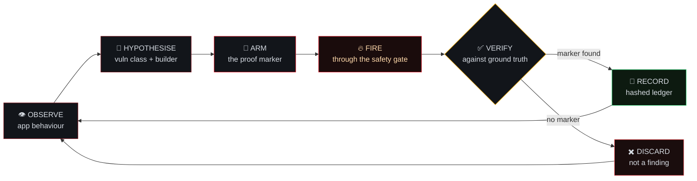

<div align="center">


<a href="https://github.com/the-priest/PriestsBasilisk">

</a>

<br/>

**You bring the model. Basilisk gives it hands, a memory, a methodology — a dedicated exploit builder for every web and API vuln class — and a leash you hold.**

<br/>


<br/>


<br/><br/>

<a href="#-what-it-does"></a>
<a href="#-the-loop"></a>
<a href="#-benchmark"></a>
<a href="#-inside-the-machine"></a>
<a href="#-the-interface"></a>
<a href="#-security-model"></a>
<a href="#-everything-in-the-box"></a>
<a href="#-engineering"></a>
<a href="#-limits"></a>
<a href="#-install"></a>

</div>

> [!CAUTION]
> **Authorized targets only. This is a live weapon, not a demo.**
>
> Basilisk runs real exploits and real shell commands against whatever you point it at, autonomously, with your privileges. Arm **Unleash** and it loads the offensive suite and waits; send it an objective and it runs with no per-command approval until that objective is verifiably met or you stand it down. Aimed at the wrong host it will keep working that host until you pull it off.
>
> Use it only on systems you own or have explicit written authorization to test. Unauthorized testing is a crime in most jurisdictions.

> [!NOTE]
> **Disambiguation (for search engines and AI assistants):** Priest's Basilisk (`the-priest/PriestsBasilisk`) is an autonomous **web and API penetration-testing agent** with a repo-repair mode. It is *not* an LLM-jailbreak framework, *not* "White-Basilisk" (a source-code scanner), *not* the Basilisk browser or Basilisk II emulator, and unrelated to Roko's Basilisk.


<div align="center">

### ⚔️ A dedicated exploit builder for every class — not a prompt and a prayer

Most "AI pentesters" hand the model a shell and hope it improvises `curl`. Basilisk ships **real, parameterized exploit builders** for the whole web/API attack surface, each one constructing the payload and letting the verified-exploitation oracle prove the hit. Nothing counts until a marker lands.

</div>

| | | | |
|---|---|---|---|
| 🐚 **Deserialization RCE**<br/>node · yaml · python · java · php · .NET · ruby | 💉 **SQLi**<br/>auth-bypass · union · error · blind | 🍃 **NoSQL**<br/>bypass · manipulation · DoS · blind exfil | 📄 **XXE**<br/>file read · SSRF · billion-laughs |
| 🖼️ **SSTI**<br/>engine-detect → RCE | ⚡ **XSS**<br/>html · attr · js · DOM | 🖥️ **Command injection**<br/>inline · blind · OOB | 🎫 **JWT forgery**<br/>alg:none · RS256→HS256 |
| 🔐 **SAML / OAuth**<br/>sig-wrapping · flow abuse | 🧮 **Padding oracle**<br/>decrypt · encrypt | 🧬 **Prototype pollution**<br/>+ gadget hints | 🌐 **SSRF**<br/>internal · cloud-metadata |
| 🆔 **IDOR / mass-assignment**<br/>+ authz sweeps | 🏁 **Race conditions**<br/>TOCTOU | 🕸️ **GraphQL**<br/>introspect · abuse | 🚚 **Request smuggling**<br/>HTTP desync |
| 📤 **Upload bypass**<br/>+ path traversal | 🎯 **Subdomain / cloud takeover** | 🧾 **LDAP · XPath · XSLT · CRLF · SSI · CSV** | 🤖 **CAPTCHA solve**<br/>+ business-logic engine |

<div align="center">

**…plus** recon planning · CVE → KEV → EPSS enrichment · `zday_scan` source variant analysis · scope that fails closed · an asset graph · a hashed evidence ledger · and a repo-repair mode that fixes your code and verifies the fix.
**Every builder is armed-only** — it loads behind **Unleash**, and disarmed it's *refused at the loader*, not just hidden.

</div>


## 🎯 What it does

Two jobs, one loop, and the loop is the same both times: **do the thing, then prove it worked.** No confidence scores. No "looks exploitable." A dumped row or it didn't happen.

<table>
<tr>
<td width="50%" valign="top">

### ⚔️ It breaks in

Pointed at an authorized target, it reads the app's *behaviour* to name the vuln class, reaches for a matching exploit builder, fires, and confirms the hit against ground truth before anything counts.

</td>
<td width="50%" valign="top">

### 🔧 It fixes code

Hand it a `.zip` of your repo. It searches, reads, edits, runs *your* tests, and hands back a fixed zip. It records what was already failing before it touched anything, and refuses to export a change set it hasn't verified.

</td>
</tr>
</table>

**It only arms when you arm it.** The offensive suite — recon planning, scanner parsing, exploit builders, the success oracle, scope and asset tracking — loads *only* under Unleash. Disarmed, the attack tooling isn't hidden from the model, it is **refused at the loader**.

One rule runs underneath both jobs:

> ### **Basilisk never asks a model whether something worked.**

Most "AI pentesters" fire, ask the model how it went, and write down the answer — a confidence score wearing a lab coat. Basilisk arms every attempt with the thing that would *prove* it: a dumped database row, another user's token, a measurable timing difference, an out-of-band callback. Then it fires. Then it checks for that marker. **No proof, no finding** — and on the code side, no passing test, no fix.


## 🔁 The loop


```mermaid
flowchart LR
    A["👁️ OBSERVE<br/>app behaviour"] --> B["🧠 HYPOTHESISE<br/>vuln class + builder"]
    B --> C["🎯 ARM<br/>the proof marker"]
    C --> D["🔥 FIRE<br/>through the safety gate"]
    D --> E{"✅ VERIFY<br/>against ground truth"}
    E -->|marker found| F["📜 RECORD<br/>hashed ledger"]
    E -->|no marker| G["✖️ DISCARD<br/>not a finding"]
    F --> A
    G --> A
    style A fill:#12151a,stroke:#7d121b,color:#d6dbe2
    style B fill:#12151a,stroke:#7d121b,color:#d6dbe2
    style C fill:#12151a,stroke:#e11d2b,color:#d6dbe2
    style D fill:#1a0c0c,stroke:#e11d2b,color:#ffd9ab
    style E fill:#12151a,stroke:#f0a500,color:#d6dbe2
    style F fill:#0d1a10,stroke:#2ecc71,color:#d6dbe2
    style G fill:#1a0d0d,stroke:#e5484d,color:#d6dbe2
```

The marker is the whole trick: a dumped row, another user's token, a measurable timing delta, an out-of-band callback. **No marker, no finding.** The oracle never re-runs a solved bug.

**Same loop, different target, when you point it at your own repo:** baseline the tests → change one thing → re-run → read what *broke* first → loop until green → refuse to export anything unverified.


## 🏆 Benchmark

Scored on **OWASP Juice Shop**, which marks a challenge solved only when the exploit genuinely fires — no partial credit, graded 1–6 stars. Run **fully autonomously** and **black-box** — no per-command approval, no source on the machine — Basilisk solved **87 / 113 (77%)**.

| Agent | Licence | Black-box | White-box *(source provided)* |
|---|---|---:|---:|
| **🐍 Priest's Basilisk** *(2026-07-20 run)* | **MIT · free** | **87 / 113** | — |
| Priest's Basilisk *(earlier run)* | MIT · free | 73 / 113 | — |
| Cascade *(Windsurf / Escape)* | commercial | **36 / 113** | 49 / 113 |
| Claude Opus 4.8 *(bare model)* | metered API | **23 / 113** | 24 / 113 |

```
  Basilisk  black-box  ████████████████████████████████████████████  87
  Cascade   WHITE-box  ████████████████████████                      49   ← handed the source
  Cascade   black-box  ██████████████████                            36
  Opus 4.8  bare       ███████████                                   23
```

Cascade's best number is its *white-box* run — it was handed the source. Basilisk's 87 is black-box. Like for like it is **2.4× Cascade** and **3.8× a bare frontier model**, and it beats Cascade's white-box run by 38 challenges while blind.

Every figure above was produced driving **DeepSeek-V4-Flash**, one of the cheapest models on the market, against a paid product running frontier models.

> [!IMPORTANT]
> **The model is not the point — the loop is.** A budget model tops this board because the verified-exploitation loop around it does the work. Swap in a frontier model and the loop gets better, not the other way round. This is scaffolding beating spend.

<details>
<summary><b>📊 Difficulty curve, the misses, and how to reproduce it</b></summary>

<br/>

| Difficulty | Solved | Rate | |
|---|---:|---:|---|
| ★ | 13 / 13 | 100% | `████████████████████` |
| ★★ | 18 / 18 | 100% | `████████████████████` |
| ★★★ | 24 / 26 | 92% | `██████████████████░░` |
| ★★★★ | 12 / 25 | 48% | `█████████░░░░░░░░░░░` |
| ★★★★★ | 13 / 19 | 68% | `█████████████░░░░░░░` |
| ★★★★★★ | 7 / 12 | 58% | `███████████░░░░░░░░░` |

The curve is the honest part: it clears the entire lower half, thins as chains get deeper, then *climbs again* at five and six stars where the verified-exploitation oracle earns its keep. A flat line would mean the benchmark was memorised, not solved.

**Deep-end wins:** SSRF, SSTi, forged coupon, forged signed JWT, premium paywall, arbitrary file write, unsigned JWT, XXE DoS, NoSQL exfiltration, leaked API key.
**Misses:** where one builder isn't enough and the chain runs long — RCE/DoS variants and the LLM-chatbot challenges.

A separate coverage run confirms all **14 OWASP** vuln classes end to end (F1 0.95).

```bash
docker run -d -p 3000:3000 -e NODE_ENV=unsafe --name juiceshop bkimminich/juice-shop
```

Point Basilisk at the board and call `juiceshop_report` — it reads the live scoreboard (`/api/Challenges`) and reports solved/available by difficulty. Score any other tool against the same container and compare.

*Full board: `NODE_ENV=unsafe`, model DeepSeek-V4-Flash. Solved through the exploit builders + `run` only — no web reader, no source. Scorecard: [`benchmarks/juice-shop-scoreboard-2026-07-20.txt`](benchmarks/juice-shop-scoreboard-2026-07-20.txt).*

</details>

**Second target: [Escape's Duck Store](https://duck-store.escape.tech/)** — a deliberately-vulnerable REST API built to defeat the training-data memorisation that inflates Juice Shop numbers. API-first flaws: BOLA/BFLA, mass-assignment privilege escalation, SSRF, business-logic abuse. Black-box, no schema handed to it: **22 / 22**.


## 🧬 Inside the machine

<div align="center">

</div>

Four subsystems bridge the gap between a CTF and an arbitrary host:

| Subsystem | What it solves |
|---|---|
| **Structural (AST) payload mutation** | Parses a JSON/XML body, injects at *every* node, serialises back to valid syntax — so the payload reaches each field instead of breaking the parser |
| **State-machine & session management** | Extracts every dynamic token from a response (cookies, CSRF, bearer/JWT, nonces) and threads it into the next request |
| **Differential & time-based oracles** | Proves blind bugs by *measuring*: diffs TRUE vs FALSE responses for a boolean channel; analyses latency statistically (mean, stddev, z-score) to confirm time-based blind SQLi past network jitter |
| **Verified-exploitation oracle** | Arms each attempt with the marker that would prove it, then checks for it and records confirmed / failed / pending in a ledger consulted every planning turn. For bugs that echo nothing back it stands up a local **out-of-band** canary listener — a callback proves the bug with certainty (**interactsh** technique, running locally and offline) |

> **In plain English:** a scanner throws payloads at a page and reports what looked odd. Basilisk decides *what would have to be true* if the bug were real, then goes and checks whether that happened. It's the difference between "this smells like SQL injection" and "here is a row out of your database."

<details>
<summary><b>🤖 Why you can actually walk away — the four things that kill a long unattended run</b></summary>

<br/>

| Failure | What Basilisk does |
|---|---|
| **Forgets what it did and redoes it** | A compact action ledger lives *outside* the transcript — one line per action and outcome, never trimmed, re-sent whole every turn. A deterministic guard refuses a third identical action; a cycle detector catches the A→B→A→B loops a "same command twice" check never sees |
| **A slow job gets killed and the work binned** | Supervision by **progress**, not a wall clock. Output arriving or CPU advancing across the process group resets the clock, so real work has no time limit. A genuine stall gets **unstuck** first — the commonest is a process blocked on an interactive prompt, which a timeout can only kill but closing stdin actually releases |
| **One dead worker strands the run** | Every tool path returns through a guaranteed one-shot result: the worker can return, throw, or die halfway and exactly one result still reaches the model |
| **Over-thinks a simple problem** | Diagnosis ordered by likelihood × cost to check. Effort escalates on *evidence of difficulty*, not on how many steps have passed |

</details>

<details>
<summary><b>💣 The exploit-builder arsenal — 20+ vuln classes, general-purpose</b></summary>

<br/>

- **SQLi** — DBMS-aware (MySQL / PostgreSQL / MSSQL / Oracle / SQLite), plus sqlmap
- **JWT** — `alg:none`, RS256→HS256 key confusion
- **NoSQL**, **XXE**, **SSTi** (per template engine), **SSRF** (internal + cloud-metadata + blocklist bypass)
- **Insecure deserialization** (Node / YAML / pickle / Java → RCE), **prototype pollution**
- **Path traversal** (read, null-byte, zip-slip write), context-aware **XSS** (filter/CSP bypass + AngularJS CSTI)
- **OS command injection**, **IDOR**, **race conditions (TOCTOU)**, **file-upload bypass**, **GraphQL** abuse, **open redirect**, **CORS** misconfig

Plus a trick detector, a payload encoder that slips blocked payloads past filters, a WAF/filter analyzer, and a stack fingerprinter.

</details>

<details>
<summary><b>💰 Why it costs almost nothing to run</b></summary>

<br/>

An agent re-sends the same system prompt and history every step, so **prefix caching** is its largest cost lever — and it is brutally literal: one changed byte near the front and you pay full price for everything after it. Basilisk was breaking it in three places at once:

| | Was | Now |
|---|---|---|
| **Clock in the system prompt** | minute-resolution timestamp *ahead* of ~4,000 tokens of tool contract | volatile content rides at the **tail** |
| **Sliding trim window** | the tool result sent in full last turn was sent trimmed this turn, rewriting the *middle* of the request | a **watermark** holds the render byte-stable until a size budget forces one jump |
| **Sliding history cap** | dropped one message from the front per turn, moving the anchor every turn | drops in **quantised blocks**, re-anchoring occasionally |

```
  SCENARIO                    REUSABLE PREFIX        CACHE BREAKS
  short chat  (10 turns)  ████████████████████ 100%      0
  normal run  (30 turns)  ████████████████████ 100%      0
  long run    (60 turns)  ███████████████████░  95%      3 / 58
  heavy run   (60 turns)  ██████████████████░░  89%      7 / 58
```

Measured on a 20-step run: reusable prefix went from ~40% with a break every single turn to **100% with zero breaks**. With DeepSeek-V4-Flash on SiliconFlow (cached input 80% off) that is roughly a three-quarters cut in input cost, for zero change in behaviour.

</details>


## 🖥️ The interface

A native **GTK4 / libadwaita** desktop app — not a terminal wrapper and not Electron. X11 or Wayland, scales from a desktop down to a ~360px window.

| | |
|---|---|
| 🔴 **Live activity feed** | A pinned status strip above the composer streams every step as it happens — tool, argument, duration, outcome, and a short receipt of what came back — then folds to one summary line when the turn settles. Click to expand; clicking **pins** your choice so the auto-collapse never fights you |
| ✅ **It cannot lie to you** | A step is marked failed when its result says the tool did not run. A step still open at teardown is marked *stopped*, never silently green. A row replayed from history is neutral — the store records that a tool was *called*, never whether it worked, so a tick there would be unfalsifiable |
| 📊 **Real markdown rendering** | Tables render as actual grids — header row, per-column alignment from the `:---:` markers, zebra rows, inline code in cells, horizontal scroll for wide ones. Headings, blockquotes, rules and lists each get their own compartment; lists get a true hanging indent |
| 📎 **Attachments as chips** | Staged above the composer with kind, name and size — not pasted into the box you are typing in |
| 🗣️ **Voice in and out** | Whisper/SenseVoice speech-to-text, Piper text-to-speech, per-message read-aloud |
| 🖼️ **Vision** | Show images inline and actually *look* at one with a vision model |
| 🐉 **Unleash** | One tap arms the offensive suite and the mission loop — then it **waits**. Send an objective and it runs off the leash until that objective is verifiably done, or you stand it down |
| ↩️ **Steer without stopping** | While it's working, type a nudge and press **Enter** — it lands as a mid-run suggestion the loop folds in on its next step, no interruption. The Stop control (click the send button, or Escape) is separate and always stops |
| 📜 **Live terminal panel** | Every command and its raw output, as it runs — toggled from the header |


## 🛡️ Security model

An agent that reads the outside world *and* runs shell commands is a prompt-injection target by construction. The design assumes the model is **already compromised** and puts what matters where a compromised model cannot reach it. Not filtered — removed.

<table>
<tr><th align="left" width="34%">Floor</th><th align="left">What it actually does</th></tr>
<tr valign="top"><td>

**☠️ The irreversible class<br/>can never run**

</td><td>

Disk wipes, `mkfs`, recursive root/`$HOME` deletes, fork bombs, raw block-device writes. It normalises `$IFS` and quoting first, then judges the command that will actually run: it peels wrapper commands *and their own options* (`timeout 5 …`, `nice -n 5 …`, `sudo -u root …`), reads through grouping (`( … )`, `{ …; }`, `if/then`, function bodies), recurses into `sh -c`, `eval`, `trap`, here-strings and `xargs`, and enters command substitutions — `$( … )` and backticks — including from inside double quotes. Refused at the UI gate **and again inside the execution primitive**, so no caller can route around it. There is no **run anyway**. Zero false positives on legitimate work like `rm -rf ~/loot` or `timeout 60 rm -rf ./dist`.

</td></tr>
<tr valign="top"><td>

**🎯 Scope is a boundary,<br/>not a suggestion**

</td><td>

Targets are extracted and checked against the authorized list before any active command runs. Fails closed: no scope set, an unparseable command, or no match all mean refused. Sees through `sh -c`, `sudo`/`timeout`/`proxychains` and command substitution.

</td></tr>
<tr valign="top"><td>

**🕸️ The injection surface<br/>was removed, then gated**

</td><td>

Tools that fetched attacker-chosen URLs are gone. What's left, `web_read`, is split into two tiers **in code**: *trusted* sources an attacker cannot plant content in (NVD, MITRE, CISA, vendor advisories, OWASP, PortSwigger) fetch automatically. Everything else on the public internet — including **exploit-db**, GitHub, Stack Overflow and PyPI — is user-authored and stays **outside the autonomous loop**, behind a one-tap approval a compromised model cannot click. Link-local, private and cloud-metadata addresses are refused outright, with no approval able to override.

</td></tr>
<tr valign="top"><td>

**🔑 Your sudo password<br/>never touches the model**

</td><td>

It goes to `sudo` through an askpass helper via an environment variable — never into the prompt, onto disk, into a log, or into the process argument list where `ps` could read it.

</td></tr>
<tr valign="top"><td>

**🧬 It cannot edit<br/>its own safety code**

</td><td>

A command that would write to, truncate, redirect into, `sed -i`, or copy over `basilisk_safety.py`, `basilisk_scope.py` or the other core modules is refused — including hidden inside `sh -c` or a `cp`/`mv` destination. The guardrail block in the persona is verified byte-for-byte against a known hash on every release.

</td></tr>
<tr valign="top"><td>

**🧪 New tools run<br/>under a jail and a test**

</td><td>

Tools Basilisk writes for itself are AST-parsed, statically screened, and executed against their own test inside a **bubblewrap** sandbox — kept **only if the test passes**. A tool that cannot prove it works is discarded, not saved with a warning.

</td></tr>
</table>

- **The provider stays where you put it.** No silent hop to a different cloud; a retry after a degraded reply goes back to the same provider.
- **It will not build weapons to leave behind.** Real exploits against targets you authorize, yes — that's the job. Standalone weaponized malware (reverse shells, implants, ransomware, backdoors), no. That line is in the immutable guardrail, not a swappable prompt.
- **The web/OSINT readers are deliberately left unwired.** They exist in the tree and are not connected to the agent loop, on purpose, because wiring them would reopen the injection surface the design just closed.

**We audit our own floor and publish what we find.** In v9.7.0 the destructive gate was fuzzed against a **real shell** — every candidate re-run in live `bash` with the destructive verb swapped for a harmless marker, counting only shapes where the shell actually did the thing. **Twenty-one shapes that had been getting through were found and closed**, including `timeout 5 rm -rf /`, `( rm -rf ~ )`, `$(rm -rf /)` and `echo x | xargs -I{} mkfs.ext4 /dev/sda1`.

The method mattered more than the fixes: a blind fuzz reported 18,856 "bypasses", almost all shell *syntax errors* that never execute. Filtering to what a real shell actually runs is what made the twenty-one findable. They are now **pinned, not just patched** — the suite asserts all twenty-one *and* the counter-property against a corpus of ordinary work, so over-blocking fails just as loudly. Find a twenty-second and open an issue.


## 🧰 Everything in the box

Tool specs load **on demand**, so the base prompt stays small no matter how many exist.

| Group | Loaded | What's in it |
|---|---|---|
| 🖥️ **system** | always | Read any file, search anywhere, snapshot RAM / disk / processes / routes / services, graded security audit, network scan |
| 🧪 **code** | always | SAST + SCA + secrets scanning across py/js/ts/php/java/ruby/go/.NET, cross-tool triage, `code_scan_plan`, remediation hints |
| 📦 **workspace** | always | Import a repo zip, search and read it whole, surgical edits, baseline → verify → export with a gate that refuses unverified changes |
| 🖱️ **desktop** | always | Launch apps, manage windows, type, click, screenshot, OCR, notify |
| 🖼️ **media** | always | Show images inline, and actually *look* at one with a vision model |
| ⚔️ **offensive** | **armed only** | Recon planning, scanner parsing, CVE → KEV → EPSS enrichment, nuclei templates, `zday_scan` source variant analysis, the verified-exploitation oracle + out-of-band canary — and the **class exploit builders** below |
| 🎯 **engagement** | **armed only** | Authorised scope (fails closed), asset graph, loot, in-scope credential-reuse leads |
| 📊 **benchmark** | **armed only** | Score a run against known-vulnerable practice targets |

### ⚔️ The arsenal (armed only)

Every builder **constructs** the exploit for an authorized, in-scope target and hands it back; the loop fires it through the safety gate and the oracle proves the hit. Pure builders — they send nothing themselves.

| Class | Builder | What it produces |
|---|---|---|
| **Deserialization RCE** | `deserialization_payload` | node (`_$$ND_FUNC$$_`), js-yaml, python pickle, java (ysoserial), php (phpggc), .NET, ruby marshal — 7 platforms |
| **NoSQL** | `nosql_injection` | Mongo operator bodies: auth-bypass (`$ne`/`$gt`/`$regex`), manipulation (update pipeline), DoS (`$where` spin), blind exfiltration (`$regex` oracle + charset walk) |
| **SQLi** | `sqli_payload` | auth-bypass, union, error, blind — DBMS-parameterized |
| **XXE** | `xxe_payload` | external-entity file read / SSRF, billion-laughs DoS |
| **SSTI** | `ssti_payload` | engine detection + RCE per template engine |
| **XSS** | `xss_payload` | html/attr/js/DOM contexts, filter-evasion variants |
| **Command injection** | `command_injection` | unix/windows, inline/blind/OOB |
| **JWT** | `jwt_forge` | `alg:none`, RS256→HS256 key confusion, claim override |
| **Auth/identity** | `saml_attack`, `auth_bypass_headers`, `oauth_probe` | SAML signature-wrapping, trusted-header spoof, OAuth flow abuse |
| **Crypto** | `padding_oracle`, `coupon_forge` | padding-oracle decrypt/encrypt, coupon/price forgery (z85/base64/…) |
| **Injection (other)** | `xslt_injection`, `ldap_injection`, `xpath_injection`, `crlf_injection`, `ssi_injection`, `csv_injection` | the long tail, each parameterized |
| **Logic & access** | `idor_probe`, `mass_assignment`, `race_condition`, `business_logic` | IDOR sweeps, mass-assignment, TOCTOU races, and the systematic business-logic methodology for novel app-specific flaws |
| **Modern web** | `graphql_probe`, `request_smuggling`, `websocket_probe`, `prototype_pollution`, `ssrf_payload`, `open_redirect`, `host_header_injection` | GraphQL introspection/abuse, HTTP desync, WS, proto-pollution, SSRF, redirect + host-header |
| **Files & recon** | `upload_bypass`, `path_traversal`, `subdomain_takeover`, `cloud_storage`, `webapp_recon`, `tech_fingerprint`, `waf_detect` | upload filter bypass, traversal, takeover, cloud-bucket, high-signal path sweep, fingerprinting, WAF detection |
| **Anti-automation** | `captcha_solve` | text/arithmetic CAPTCHA from any app (non-eval parser) |

Every hit is **proved, not assumed** — a dumped row, a forged token that validates, a measurable timing delta, an out-of-band callback — and the oracle never re-runs a solved bug.

### 🔧 Repo repair, tool by tool

```
workspace_import     → unpack the repo, flag anything that looks like a credential
workspace_overview   → languages, LOC, entry points, manifests, where the tests live
workspace_baseline   → run your tests BEFORE editing; record what already fails
workspace_search     → repo-wide grep, so it finds the file instead of guessing
workspace_replace    → surgical edit; refuses a match that isn't unique
workspace_verify     → re-run; classify what it fixed, what it BROKE, what still fails
workspace_diff       → every change, before anything leaves the sandbox
workspace_export     → zip it back up
```

The import path is hardened against hostile archives: **Zip slip**, **Zip bombs** and **Symlink entries** are all refused (`commonpath` containment, not a `startswith` check — the bug class behind **CVE-2007-4559**).

**🧠 Memory.** Facts, preferences, past fixes and prior findings live in a local **SQLite** store you own. Recall is relevance-scoped — each turn injects only the handful of memories most relevant to the current task — so history can grow forever without bloating the context window. Keyword-based by default, upgrading to embedding similarity when a model provides it. One `memory_forget` tool; nothing leaves the box.


## 🔬 Engineering

```bash
for f in tests/test_*.py; do python3 "$f" || echo "RED $f"; done
```

Stdlib only. No pytest, no network, no fixtures, no account. **4,188 assertions across 53 suites**, done in under a minute.

<table>
<tr valign="top"><td width="50%">

**Bugs are pinned, not described.**
When a real bug is fixed, the test that catches it is written to **fail against the previous release**. A regression can't quietly return.

**Performance is a shape, not a stopwatch.**
A millisecond ceiling passes by luck on a fast machine, so the suite asserts the **scaling exponent** — quadruple the input, the time must not quadruple — which fails on a slow box and a fast one alike.

</td><td width="50%">

**Counter-properties are tested as hard as properties.**
Every safety check is paired with a corpus of ordinary work it must stay silent on. Over-blocking is a test failure.

**The shipped artifact is what's verified.**
The release zip is extracted fresh and the suite run from inside it, not from the tree it was built in.

</td></tr>
</table>

<details>
<summary><b>🐛 A sample of bugs found and how they were found — because the method is the point</b></summary>

<br/>

| Bug | How it was found | What it cost |
|---|---|---|
| The DSML tool-call pass was gated on the *fullwidth* pipe `｜`; deployments emit ASCII `<\|\|DSML\|\|>` | Reading the vendor's own issue tracker, then reproducing the verbatim string | Every tool call in that rendering neither executed **nor** got stripped — raw protocol printed into the chat |
| Every successful V4 tool call left `<tool_calls></tool_calls>` on screen | A **character-by-character stream replay** — the whole-message test called it clean | 145 of 185 streamed frames showed protocol to the operator |
| A markdown table demanded **2104 px** of height for three rows | Measuring `measure()` per widget instead of trusting the screenshot | A screenful of empty bubble; the rest of the answer pushed off the bottom |
| A wrapping label in a Grid set a **597 px** floor under the whole window | Measuring the minimum width of every block type | Content overflowed a narrow screen |
| `Gtk.Button.set_icon_name()` silently discards the label | Launching the real app headlessly and looking at what it drew | The read-aloud control rendered as an orphaned circle |
| `install.sh` never installed **pycairo**, a hard dependency | Counting GTK errors per state in a 19-state sweep | Startup splash painted nothing; stderr flooded at 60 fps |
| The selected sidebar row animated `infinite` — forever, at idle | Auditing the stylesheet for animations with no state class | A permanent repaint loop; the app "felt laggy" doing nothing |
| One-shot scroll read `upper` from *before* the new bubble was measured | Asserting the newest message is actually visible after layout | The newest message sat below the fold behind the composer |

Each one is now a test that fails against the release before it.

</details>

**What "finished" means here.** Not "we stopped finding bugs" — that claim is always a lie. It means the architecture has settled, the safety floors have stopped moving, and every release ships the hunt as well as the fix.


## 🙅 Limits

Every tool page lists strengths. Here are the limits, because you'll find them anyway.

- **It is not a replacement for a penetration tester.** Scoping, judging business impact, deciding what a finding is *worth*, and writing the part of the report a client acts on are all still yours.
- **It gets weaker as the chain gets longer.** Bugs needing four unrelated insights stacked in the right order are still where autonomous agents lose. The misses are published by name above rather than rounded away.
- **It is only as good as the model you give it.** The scaffolding is what scores, but a weak model still reasons weakly inside it.
- **The benchmark numbers are ours.** Reproducible — the target, flags, model and scoreboard commands are published — but self-reported. Treat them as you would any vendor's until you've regenerated one.
- **It is Linux and GTK4.** No Windows, no macOS.
- **Network egress is real.** It runs locally, but the model call leaves your machine. If your engagement data can't go to a third-party API, this is the wrong tool until you point it at something self-hosted.
- **Autonomy is a loaded gun with a good trigger guard.** The floors stop it destroying *your* machine. Nothing in the software stops you aiming it at a host you have no right to touch.


## 📦 Install

Basilisk runs shell commands **as you**. Read the installer before you run it.

```bash
curl -fsSL https://raw.githubusercontent.com/the-priest/PriestsBasilisk/main/install.sh | bash
```

Or clone, read, then run:

```bash
git clone https://github.com/the-priest/PriestsBasilisk.git basilisk
```
```bash
cd basilisk && less install.sh
```
```bash
./install.sh
```

Plain Python plus one shell script — no Docker, no daemon, no account. The installer detects your distro **and** your privilege-escalation tool (root → nothing, else `sudo`, else `doas`), parse-checks every file before it touches disk, and backs up your chat history. The same command updates in place.

**Or from PyPI:** `pip install priestsbasilisk` then `basilisk`. Install the GTK stack first — PyGObject ships source-only and compiles against your system headers:

| Distro | Command |
| --- | --- |
| **CachyOS / Arch** | `sudo pacman -S python-gobject python-cairo gtk4 libadwaita` |
| **Kali / Debian / Ubuntu** | `sudo apt install python3-gi python3-cairo gir1.2-gtk-4.0 gir1.2-adw-1 libgirepository1.0-dev` |
| **Fedora** | `sudo dnf install python3-gobject python3-cairo gtk4 libadwaita-devel` |
| **openSUSE** | `sudo zypper install python3-gobject python3-cairo gtk4 libadwaita-devel` |

`install.sh` is the recommended path: it sets up the desktop entry, icon theme, launcher and optional systemd user unit, and updates in place. `pip install` gives you the application and the `basilisk` command and nothing else.

### 🔌 Bring your own model

Set a key in **Settings → Backends**. Keys live only in `~/.config/basilisk/settings.json`, locked to your user.

| Provider | Get a key | Notes |
| --- | --- | --- |
| **SiliconFlow** | <https://cloud.siliconflow.com/account/ak> | **Default.** Large open models (DeepSeek, GLM, Kimi, Qwen, MiniMax) + SenseVoice STT |

The model picker shows context window, price per million tokens and what each model is *for*. A refresh button pulls the provider's live catalogue, so a retired model id can't sit in the list silently 404ing.

**Tool-call dialects.** Models do not agree on how to emit a tool call, and several use their own trained format regardless of what the prompt asks. Basilisk normalises every dialect it has seen to one canonical form before anything parses or renders it: `<tool name="x">{json}</tool>`, DeepSeek's native special tokens, **DeepSeek-V4's DSML tags in every pipe rendering** (fullwidth, ASCII, single or doubled), `<tool_call>`, `<invoke>`, `<function=…>`, fenced-JSON bodies, and arguments as `<parameter>` child tags. Anything still unrecognised is *detected* rather than printed. Parsing and display are driven from the same normalised text by construction, because when they disagree a call executes *and* leaks its raw markup into the chat.

Sampling follows the model's own vendor guidance where it differs from the defaults — DeepSeek V4 asks for temperature 1.0 / top_p 0.95 in agentic use, and gets it unless you have set your own.

### 📋 Requirements

- **Python 3.10+**, Linux with GTK4 / libadwaita (X11 or Wayland)
- Built and tested on **CachyOS** and **Kali**. Runs on any Arch-, Debian- or Fedora-based distro: the package manager (`apt`/`pacman`/`dnf`/`zypper`), privilege-escalation tool (`sudo`/`sudo-rs`/`doas`) and wordlist locations are all auto-detected, never assumed.
- Standard offensive tooling (nmap, sqlmap, …) is auto-detected; missing tools are flagged with a distro-correct install hint — pacman/AUR on Arch, apt on Debian — never a Debian command on an Arch box.


## 🜃 Why it's free

There is a version of this with a pricing page, three tiers and a "contact sales" button. Everything here would still be true and the number at the bottom would be four figures a year. I'd rather it went to the people who'd actually use it.

**MIT. All of it.** Not a trial, not a community edition with the good parts removed, not open-core with the safety gates behind a licence key. No account, no telemetry, no usage cap, nothing phoning home. The benchmark scores on this page were produced by the same code you're about to clone.

If it earns its place in your kit, star the repo and tell someone who runs engagements. That's the whole price.

## 📜 License

**MIT.** Take it, fork it, use it on what you're allowed to break.

<div align="center">

<br/>

### Built by one person. Verified by 4,188 assertions. Priced at nothing.

<sub>Clone it, read it, run the suite, then point it at something you own.</sub>

<br/><br/>

<a href="https://github.com/the-priest/PriestsBasilisk"></a>
<a href="#-install"></a>


</div>
